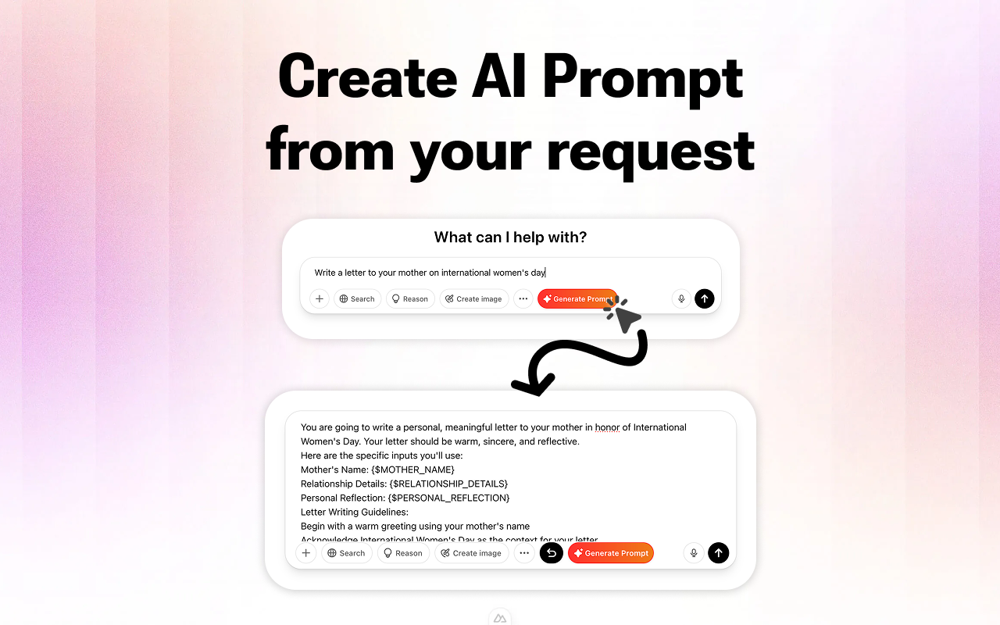

# AI Prompt Generator & Optimizer (TaoPrompt Extension)

---

## 🚀 Giới thiệu

TaoPrompt Extension là tiện ích mở rộng trình duyệt giúp bạn tạo, tối ưu và quản lý prompt AI một cách nhanh chóng trên các nền tảng như ChatGPT, Gemini, Claude, Copilot và nhiều nền tảng AI khác. Tận dụng sức mạnh AI để tăng hiệu suất sáng tạo và làm việc của bạn chỉ với một cú nhấp chuột!

---

## 🎯 Tính năng nổi bật

- Tạo & tối ưu prompt AI cho nhiều nền tảng chỉ với một click.
- Hỗ trợ đa nền tảng: ChatGPT, Gemini, Claude, Copilot, v.v.
- Giao diện hiện đại, dễ sử dụng, hỗ trợ dark mode.
- Đa ngôn ngữ (English, Tiếng Việt).
- Đăng nhập nhanh, quản lý profile, đồng bộ dữ liệu.

---

## 🖥️ Ảnh màn hình

<p align="center">
  
  
</p>

---

## ⚡️ Cài đặt

### Chrome
1. Tải về hoặc clone repository này:
   ```bash
   git clone https://github.com/bombap/taoprompt-extension.git
   cd taoprompt-extension
   ```
2. Cài đặt dependencies:
   ```bash
   pnpm install
   ```
3. Build extension:
   ```bash
   pnpm build:chrome
   ```
4. Mở `chrome://extensions/`, bật "Chế độ dành cho nhà phát triển", chọn "Tải tiện ích đã giải nén", và chọn thư mục `dist/chrome-0.0.1`.

### Firefox (thử nghiệm)
- Build với lệnh `pnpm build:firefox` và tải thư mục `dist/firefox` vào Firefox.

---

## 🛠️ Hướng dẫn sử dụng

1. Đăng nhập tài khoản tại popup extension hoặc trang [taoprompt.com](https://taoprompt.com).
2. Mở ChatGPT, Gemini, Claude, Copilot hoặc nền tảng AI hỗ trợ.
3. Extension sẽ tự động hiển thị nút "Generate Prompt" ngay dưới ô nhập liệu.
4. Nhập nội dung bạn muốn tối ưu hóa, nhấn "Generate Prompt" để nhận prompt AI tối ưu.


---

## 🌐 Đa ngôn ngữ

- English
- Tiếng Việt

*Bạn có thể thay đổi ngôn ngữ giao diện trong phần Settings của extension.*

---

## 💡 Đóng góp & phát triển

- Fork repo, tạo branch mới và gửi pull request.
- Báo lỗi hoặc đề xuất tính năng mới tại [Issues](https://github.com/bombap/taoprompt-extension/issues).

### Cấu trúc thư mục chính

```
.
├── src
│   ├── background/         # Service worker/background scripts
│   ├── content-script/     # Script inject vào trang AI
│   ├── composables/        # Vue composables
│   ├── components/         # Vue components
│   ├── ui/                 # UI pages (popup, options, setup, ...)
│   ├── locales/            # File dịch ngôn ngữ
│   └── ...
├── dist/                   # Thư mục build extension
├── manifest.config.ts      # Cấu hình manifest
└── package.json
```

#### Tham khảo cấu trúc source

*Cấu trúc source được tham khảo và tùy biến từ [vite-vue3-browser-extension-v3](https://github.com/mubaidr/vite-vue3-browser-extension-v3)*

---

## 📦 Công nghệ sử dụng

- [Vue 3](https://vuejs.org/) + [Vite](https://vitejs.dev/)
- [TypeScript](https://www.typescriptlang.org/)
- [Pinia](https://pinia.vuejs.org/) (state management)
- [Tailwind CSS](https://tailwindcss.com/)
- [webextension-polyfill](https://github.com/mozilla/webextension-polyfill)
- [Marked](https://github.com/markedjs/marked) (markdown parser)
- [Nuxt UI](https://ui.nuxt.com/)

---

## 📞 Liên hệ & Hỗ trợ

- Website: [https://taoprompt.com](https://taoprompt.com)
- Email: kimduc10a@gmail.com


---

## ⭐️ Đóng góp & Ủng hộ

Nếu bạn thấy extension hữu ích, hãy ⭐️ repo này và chia sẻ với bạn bè!

---

Copyright © 2025 [TaoPrompt.com](https://taoprompt.com)

